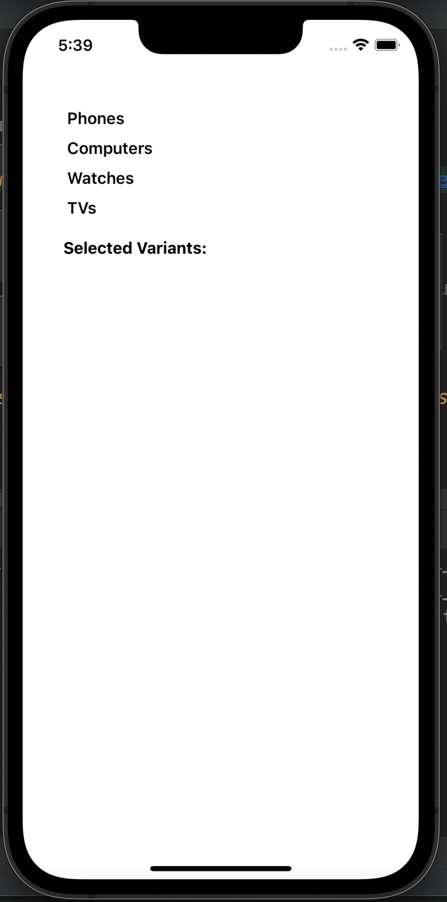
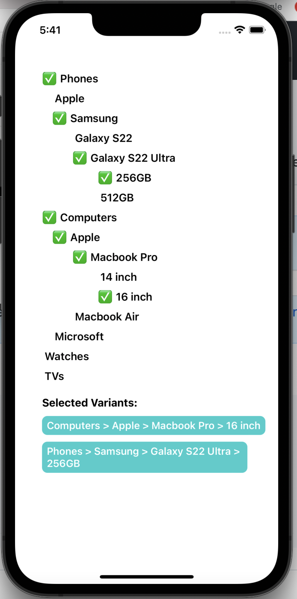

# Soum Technical Assessment

### Screenshots
Initial state            |Products selected           |
:-------------------------:|:-----------------------------:|
  |  

### How to run the app locally
run the app on the simulator/emulator
   - to run the app on iOS, run `npx pod-install` then run `npm run ios`
   - to run the app on Android, run `npm run android`

### Unit tests
- [SelectedProducts.tsx](./src/product/components/SelecetdProducts/SelectedProducts.tsx) : [SelectedProducts.test.tsx](./src/product/components/SelecetdProducts/__tests__/SelectedProducts.test.tsx)

